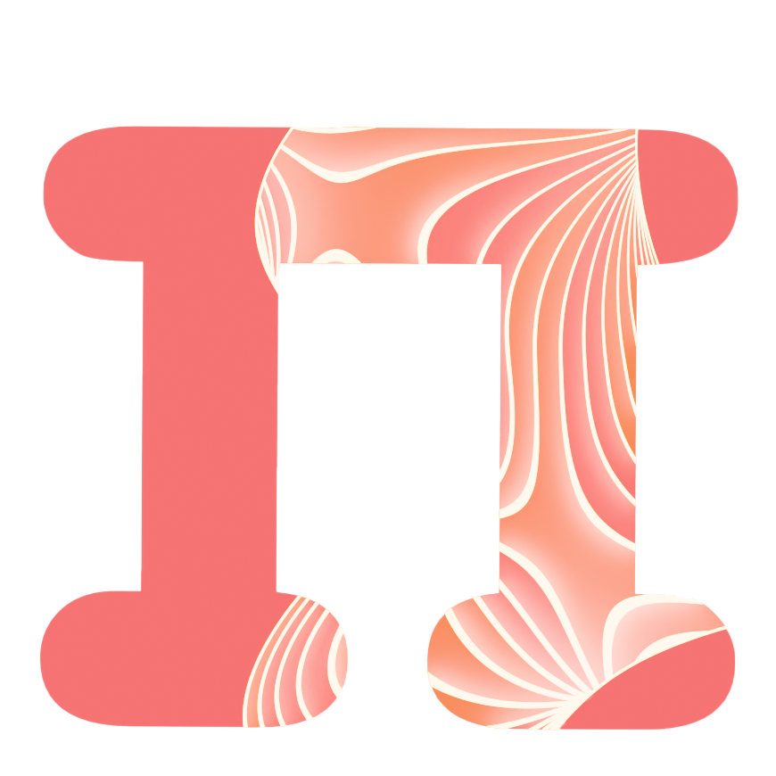
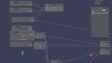

<p align="center">
  
</p>

# psiEngine

A small engine for looking at physics I compute on the GPU. Vulkan does the rendering, the GPU does the compute, and a node graph sits in the middle so I can wire a simulation up without recompiling every time I want to change a constant.

This is not a game engine and I have no plans to make it one. It exists because every time I write a kernel that produces a cloud of numbers I want to see the cloud, rotate it, poke at the parameters and see it change, and I got tired of doing that through matplotlib and a screenshot. The first real workload is the hydrogen atom: give it (n, l, m) and it draws the orbital.

<p align="center">
  
  
</p>

## How it is put together

**Rendering is Vulkan.** SDL3 owns the window and input, `volk` loads the API, shaders are written in [Slang](https://shader-slang.org/) and compiled at runtime, so a shader edit is a restart and not a rebuild. The main scene layer (`DefaultGameWorld`) is GPU driven: a compute pass builds the indirect draw commands and the vertex work for lines, circles and orbital samples happens in compute shaders before anything reaches the graphics pipeline.

**Compute runs on the GPU too.** Inside the engine that is Vulkan compute, the `*_ops.slang` files under `libs/graphics/window/assets/shaders/`. The heavy numerical work, sampling electron densities at the bandwidth roof, is CUDA and lives in its own repo, [cuda-orbital-sampler](https://github.com/nnamu-cl/cuda-orbital-sampler), where I can profile it properly. The engine is the place those samples get drawn.

**Everything in the scene is a component.** A tiny ECS in `libs/core` (component store, type ids) and a set of components in `libs/graphics/window/windowlib/Components/`: `Transform`, `MeshRenderer`, `LineRenderer`, `VolumeRenderer`, `Atom` (the quantum numbers, validated so l < n and |m| <= l) and `AtomVisualizer` (how those numbers become geometry). Components draw their own inspector UI.

**The node graph drives values.** `libs/graphics/nodeGraph` is a typed node system (`float`, `int`, `vec2..vec4`, `mat4`) with value, math, vector, object and graph nodes, drawn on top of `imgui_node_editor`. Node outputs bind to component properties, so a sine node wired into a transform is an animation and a constant node wired into an atom is a slider that changes the orbital.

**Projects save and load.** `libs/project_management` plus `apps/psi/src/project/` handle a project registry, window state and scene serialisation through [glaze](https://github.com/stephenberry/glaze) JSON.

**Two applications sit on top:**

- `apps/psi`, the one I actually use. Two modes, `WorldViewport` for placing and manipulating objects with gizmos, `GraphEditor` for wiring the node graph. ImGui panels for create, inspect, stats, camera and saving.
- `apps/decisions`, a side experiment: a cashflow scenario engine scripted in Lua through sol2. It shares the window library and nothing else. It will probably move out at some point.

`apps/PhysicsCodeDemos` holds small standalone physics programs (a pendulum right now) that I write before deciding whether something deserves a component.

## Layout

```
apps/
  psi/                      the main application (psiQuantum)
    src/layers/             world, UI and node editor layers
    src/UI/                 toolbars and panels
    src/project/            project hub and registry
    tests/
  decisions/                Lua scripted cashflow scenarios (decision_engine)
  PhysicsCodeDemos/         standalone physics programs
libs/
  core/                     ECS: component store and type ids
  graphics/
    window/                 WindowLib: SDL3 + Vulkan application, layers, pipelines
      windowlib/Layers/DefaultGameWorld/   scene, camera, mesh, pipeline manager, compute pipeline
      windowlib/Components/                Transform, MeshRenderer, LineRenderer, VolumeRenderer, Atom, AtomVisualizer
      windowlib/Data/                      plain data structs the components point at
      assets/shaders/DefaultGameWorld/     Slang shaders, graphics and compute
      examples/                            OpenWindow, GraphicsDemo, Im3DDemo, GraphDemo, SavingDemo
      tests/
    nodeGraph/              node system, node types and the ImGui drawers
    implot/                 vendored ImPlot
  project_management/       project registry
  tools/                    small utilities (circular buffer)
assets/                     meshes, textures and the test shader
external/                   SDL3, imgui, imgui_node_editor, im3d, ImGuizmo, ktx, sol2, glaze deps and friends
docs/images/
```

## Building

You need CMake 3.20 or newer, a C++23 compiler, the Vulkan SDK with `VULKAN_SDK` exported, and Slang installed where CMake can find `slangConfig.cmake` (the top level `CMakeLists.txt` falls back to `/usr/local/lib64/cmake/slang`). SDL3 is vendored and built from source. GLM and glaze are fetched on first configure.

```bash
cmake -B cmake-build-debug -DCMAKE_BUILD_TYPE=Debug
cmake --build cmake-build-debug
./cmake-build-debug/bin/psiQuantum
```

Linux with Wayland is what I develop on now. It started life on Windows with MSVC and the `VK_USE_PLATFORM_WIN32_KHR` path is still in the CMake, but I have not built it there for a while, so expect to fix things.

The window library has its own test executables (`tests_*` targets, node graph, line renderer, pipeline manager, mesh generation, materials, the Vulkan setup) and the psi app has `psi_tests`, `psi_node_save_tests` and `psi_camera_tests`. They are plain executables rather than a test framework, run the one you care about.

## Status

Work in progress and it moves in bursts. The rendering path, node graph, saving and the atom components work. What I am building towards is the CUDA sampler feeding the visualizer directly rather than through dumps, and a proper simulation loop on the world layer.

## Third party

SDL3, Vulkan, volk, Slang, Dear ImGui, imgui_node_editor, ImGuizmo, im3d, ImPlot, GLM, glaze, KTX, tinyobjloader, stb_image, nativefiledialog-extended, sol2 and Lua, ScopeGuard, zpp_bits, lygia. Each keeps its own licence under `external/`.
